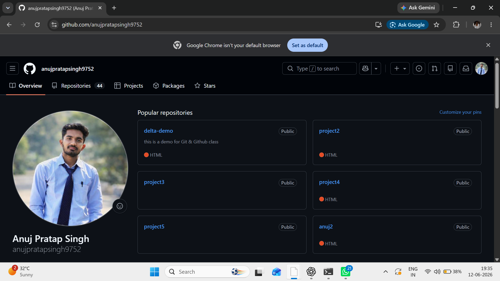
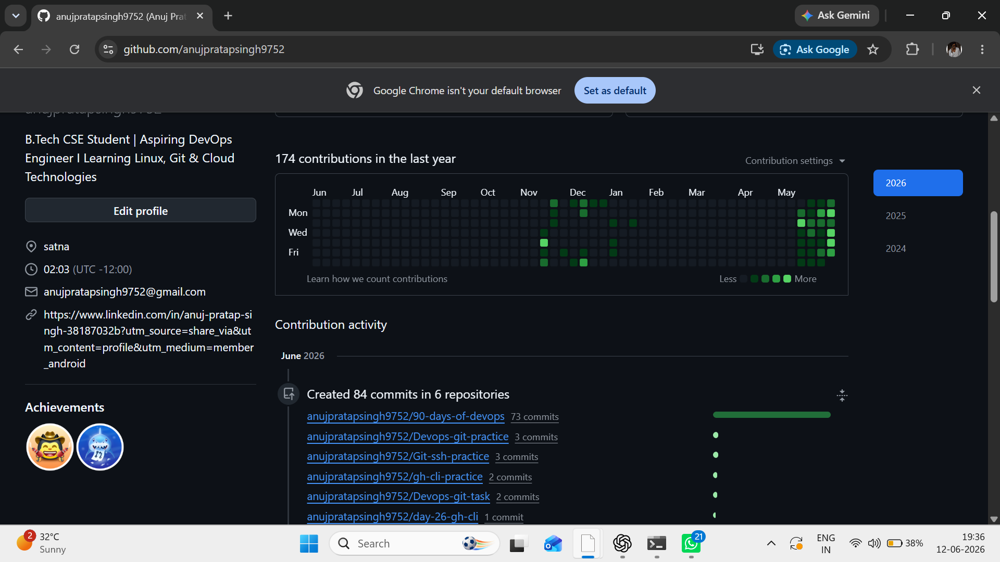
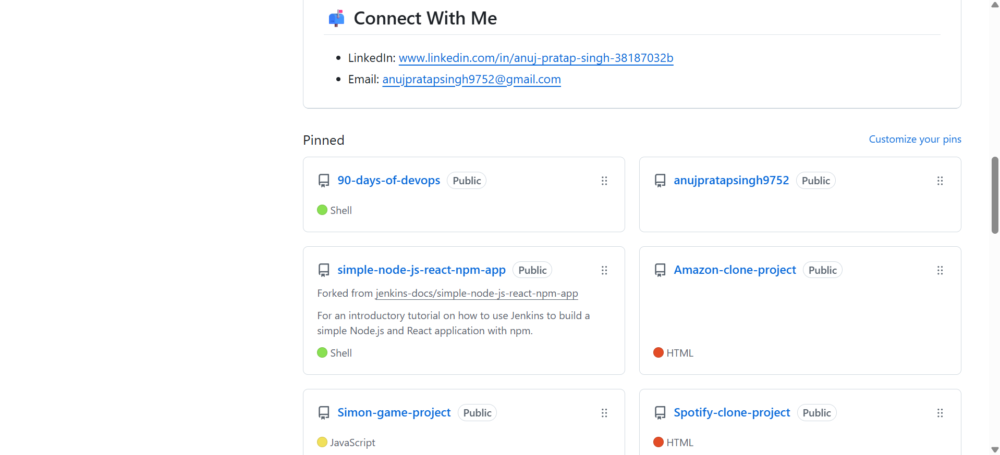

# Day 27 - GitHub Profile Makeover 

## What I Improved
- Added a professional GitHub profile README
- Organized and pinned important repositories
- Improved repository descriptions and profile presentation

## Before

## After

## Learnings
- GitHub works like a developer portfolio
- Clean documentation improves profile quality
- Organized repositories help recruiters understand projects
